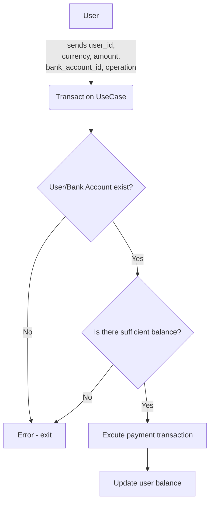
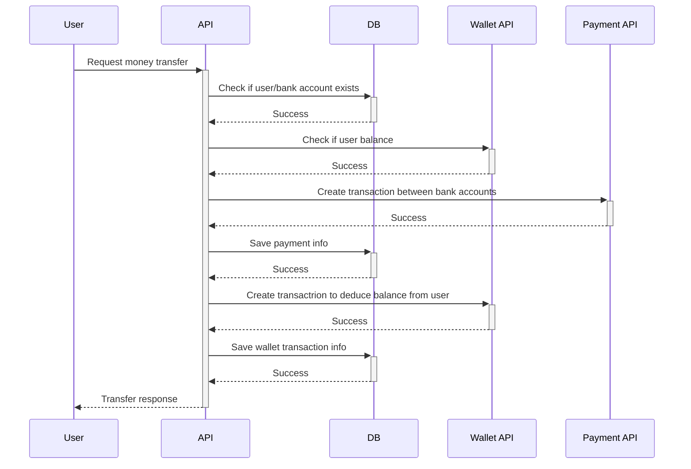
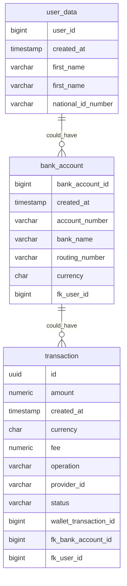

# Project Name

OnTop's code challenge (Wallet Transaction).

## About

This project is part of OnTop's code challenge, aiming to create a money transfer application from an OnTop virtual
account to a bank account. It utilizes a hexagonal architecture, Flyway, Java, Spring Boot, Gradle, and H2 Database.

### Prerequisites

[Java 11+](https://www.java.com/en/download/help/download_options.html)

[Gradle](https://gradle.org/install/)

## Features

A pre-existing account is included in the database through the Flyway script (V2__Add_Users.sql).

### Endpoints:

#### POST Transaction Creation Endpoint

- Create a new transaction by sending a POST request to the following URL:

```bash
POST http://localhost:8090/v1/transaction
```

##### Request Body (JSON):

```json
{
  "user_id": 1,
  "currency": "USD",
  "amount": 1000,
  "bank_account_id": 1,
  "operation": "WITHDRAW"
}
```

##### Response (JSON):

```json
{
  "id": "495bdd23-e238-408b-b3d9-133f748550e8",
  "user_id": 1,
  "bank_account_id": 1,
  "transaction_detail": {
    "operation": "WITHDRAW",
    "fee": 0.1,
    "currency": "USD",
    "amount": 1000,
    "status": "Processing",
    "created_at": "2023-10-30 01:38:10"
  }
}
```

#### GET Endpoint for Paginated Transaction Search

- Retrieve paginated transaction data by sending a GET request to the following URL:

```bash
GET http://localhost:8090/v1/transaction?date=2023-10-29&userId=1&amout=1000
```

##### Response (JSON):

```json
{
  "content": [
    {
      "id": "e233ada1-744d-4e32-92a3-65af52e727ed",
      "user_id": 1,
      "bank_account_id": 1,
      "transaction_detail": {
        "operation": "WITHDRAW",
        "fee": 0.10,
        "currency": "USD",
        "amount": 1000.00,
        "status": "Processing",
        "created_at": "2023-10-29 07:02:01"
      }
    },
    {
      "id": "b9f41227-487a-4561-8985-982d526a8615",
      "user_id": 1,
      "bank_account_id": 1,
      "transaction_detail": {
        "operation": "WITHDRAW",
        "fee": 0.10,
        "currency": "USD",
        "amount": 1000.00,
        "status": "Processing",
        "created_at": "2023-10-29 07:01:59"
      }
    },
    {
      "id": "a2c34b3c-3224-4324-88e4-a1f1f2de677c",
      "user_id": 1,
      "bank_account_id": 1,
      "transaction_detail": {
        "operation": "WITHDRAW",
        "fee": 0.10,
        "currency": "USD",
        "amount": 1000.00,
        "status": "Processing",
        "created_at": "2023-10-29 07:01:58"
      }
    },
    {
      "id": "e61277d8-5bc5-44be-9185-c52ffc4ab5fb",
      "user_id": 1,
      "bank_account_id": 1,
      "transaction_detail": {
        "operation": "WITHDRAW",
        "fee": 0.10,
        "currency": "USD",
        "amount": 1000.00,
        "status": "Processing",
        "created_at": "2023-10-29 07:01:56"
      }
    }
  ],
  "pageable": {
    "sort": {
      "empty": false,
      "sorted": true,
      "unsorted": false
    },
    "offset": 0,
    "page_number": 0,
    "page_size": 20,
    "paged": true,
    "unpaged": false
  },
  "last": true,
  "total_elements": 4,
  "total_pages": 1,
  "number": 0,
  "size": 20,
  "sort": {
    "empty": false,
    "sorted": true,
    "unsorted": false
  },
  "first": true,
  "number_of_elements": 4,
  "empty": false
}
```

## Getting Started

### Clone the Repository

````bash
$ git clone https://github.com/
````

### Run Locally

You can run the project locally using Gradle or in your preferred Integrated Development Environment (IDE). Use the
following command in your project directory:

```bash
$ ./gradlew bootRun
```

## Diagrams

### Flow Diagram



### Sequence Diagram



### ER Diagram

